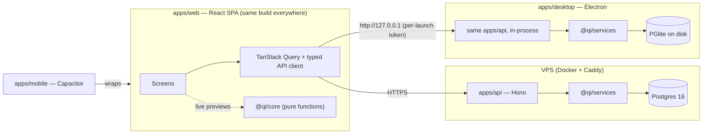
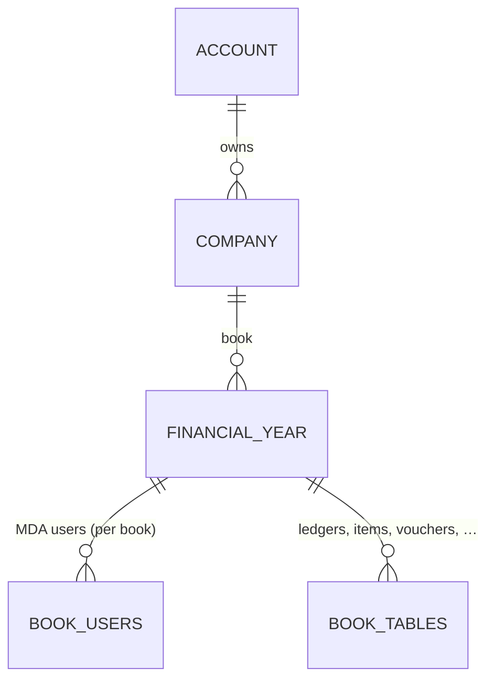

# Qyroxis Inventory — Architecture

The web rebuild of **MDA Inventory** (`../MDA-Inventory`, Flutter + SQLite) as one product shipped three ways:

| Shell | Where the data lives | Connectivity | Ships in |
|---|---|---|---|
| **Web** (first) | Cloud Postgres on the Qyroxis VPS | Online | Phase 6 |
| **Desktop** | Local embedded Postgres (PGlite) on the user's PC | Fully offline | Phase 7 |
| **Mobile** | Cloud Postgres (same as web) | Online | Phase 8 |

The ground rule is **one logic, many shells.** All three shells run the same business logic, database schema and UI code. A shell is only a thin wrapper that decides *where the API runs* and *where the database lives*.

Companion documents:
- [LOGIC-SPEC.md](LOGIC-SPEC.md): every business rule carried over from MDA-Inventory. This is the porting source of truth.
- [WORKFLOW.md](WORKFLOW.md): the phased build plan, with gates.
- [decisions.md](decisions.md): one paragraph per real choice.

---

## 1. Big picture



- **The web and mobile shells** load the SPA and call the cloud API.
- **The desktop shell** starts the *same* API inside Electron's main process, pointed at a PGlite database on disk, and loads the same SPA against `127.0.0.1`. No network is needed.
- **Both** run the same Postgres dialect, so there is one schema, one set of migrations and one set of queries for both databases.

---

## 2. Monorepo layout

pnpm workspaces + Turborepo. TypeScript everywhere, in strict mode.

```
Inventory/
├─ apps/
│  ├─ web/          React 19 + Vite SPA — every screen; the only UI codebase
│  ├─ api/          Hono HTTP server — thin routes over @qi/services
│  ├─ desktop/      Electron shell: embeds apps/api + PGlite, loads web build
│  └─ mobile/       Capacitor shell: loads web build, points at cloud API
├─ packages/
│  ├─ core/         PURE domain logic — no IO, no DB, no React (see §3)
│  ├─ db/           Drizzle schema (pg), migrations, seeds, BookContext
│  ├─ services/     Use-cases: posting, sale, purchase, masters, dashboard, reports
│  ├─ contract/     zod request/response schemas shared by api + web
│  ├─ auth/         better-auth wrapper (playbook §4.2) + role matrix
│  ├─ print/        @react-pdf templates: tax invoice, receipt/payment voucher, lists
│  └─ ui/           shadcn/ui components, AppShell, LookupBox, EnterNav, DataGrid
├─ tools/
│  ├─ importer/     MDA SQLite files → Qyroxis Inventory (customer migration)
│  └─ parity/       golden fixtures exported from the Dart app (see WORKFLOW §Parity)
└─ docs/
```

**Dependency direction (enforced with eslint `import/no-restricted-paths`):**

```
core  ←  db  ←  services  ←  api
  ↑                ↑
  └── contract ────┴──── web (calls api; imports core only for live previews)
```

`core` depends on nothing. `web` **never** imports `db` or `services`.

---

## 3. The layers, and where each piece of MDA logic goes

### 3.1 `packages/core`: the pure domain

This is a 1:1 port of the parts of the Dart code that do no IO. Every function here is deterministic and is unit-tested against golden output from the Dart app.

| Dart source | Moves to | Contents |
|---|---|---|
| `posting_service.dart` `GstCalculator` | `core/gst.ts` | `round2`, `isInterState`, `computeLine`, `roundOff` |
| `sale_service.dart` `SaleLine.compute`, `SaleTotals.of` | `core/sale.ts` | Line and bill totals, including bill discount after tax |
| `purchase_service.dart` `PurcLine.compute`, `PurcTotals.of` | `core/purchase.ts` | Line and bill totals |
| `sale_service._postLedger`, `purchase_service._postLedger` (the Dr/Cr lists) | `core/posting-rules.ts` | `saleJournal(totals, …) → AcctLine[]`, `purchaseJournal(…)`, `receiptJournal`, … The journal is computed purely; services only persist it. |
| `PostingService._validate`, `SaleService._validate`, `PurchaseService._validate` | `core/validate.ts` | Same messages, word for word ([LOGIC-SPEC §9](LOGIC-SPEC.md#9-validation-messages-verbatim)) |
| `security.dart` `Validators` | `core/validators.ts` | GSTIN (with mod-36 checksum), PAN, HSN, mobile, email, PIN |
| `code_gen.dart` `_maxSuffix` + format | `core/codes.ts` | `nextFromMax(prefix, width, existingCodes)`, `formatNo` |
| `voucher_print.dart` `amountInWords` | `core/words.ts` | Indian numbering (Crore/Lakh/Thousand) |
| `main.dart` money formatting | `core/format.ts` | Indian digit grouping, K/L/Cr compact form |
| `dashboard_service.dart` maths (ageing, trends) | `core/dashboard.ts` | The pure parts; the SQL goes to services |

> **Rounding trap:** Dart's `roundToDouble()` rounds halves *away from zero*. JavaScript's `Math.round(-12.5)` gives `-12`, where Dart gives `-13`. `round2` must be `Math.sign(v) * Math.round(Math.abs(v) * 100) / 100`, or round-off amounts on negative halves will differ by a paisa. The golden tests in Phase 1 exist to catch exactly this kind of drift.

### 3.2 `packages/db`: schema and the book context

- **Drizzle ORM, `pg` dialect.** The same schema runs on cloud Postgres (`drizzle-orm/node-postgres`) and on desktop PGlite (`drizzle-orm/pglite`).
- The schema mirrors **schema v12** of the Dart app table by table ([LOGIC-SPEC §2](LOGIC-SPEC.md#2-data-model-mapping)), with four structural changes:
  1. **Tenancy columns.** Every book table carries `book_id`. A `books` row stands for one MDA year file (`<CompCode>/MDA_Inv2627.db`), and `financial_years` is the registry row that points at it. As in MDA, deleting a year row keeps its book, and adding the same year again re-attaches it.
  2. **`Misc_Master` is split** into `units`, `godowns`, `stock_groups`, `stock_sub_groups`, `sale_types` and `cities`. The original codes (`GD001`, `UN019`, `SSG0001`, …) are kept as unique business keys, so the logic is unchanged. Foreign keys copy MDA's: only the ones MDA has, so deletes behave the same (Q-17).
  3. **Surrogate `id uuid` (v7) primary keys** on every row, with the business code (`AccCode`, `PartCode`, `BillNo`) as `UNIQUE (company_id, fy_id, code)`. UUIDs keep a future desktop↔cloud sync possible without renumbering.
  4. **Money stored as `numeric(14,2)`**, quantities as `numeric(14,3)`, and rates as `numeric(9,2)`. Values are parsed to `number` at the repository boundary and computed with the Dart-identical `round2`.
- **Seeds** port `_seedDefaultGroups`, `_seedDefaultUnits`, `_seedTaxLedgers`, `_seedStates`, `_seedTaxRates`, `_seedVoucherSeries`, `_seedPurchaseSeries` and `_seedSaleSeries` verbatim, with the same codes (A001…, TAX001…, SAL001, PUR001). They run when a financial year (book) is created.
- **`BookContext`** replaces the static fields on `DbService`:
  ```ts
  type BookContext = {
    accountId; companyId; fyId;
    user: { code; name; role: string };   // DbService.currentUser / currentRole (book login)
    companyStateCode: string;      // DbService.companyStateCode
    fyFrom: Date; fyTo: Date;      // DbService.fyFrom / fyTo
  };
  ```
  Every service call receives one, resolved per request from the session plus the `X-Book` header (`companyId:fyId`). Several books can be open at once in different tabs, which the Dart app could not do.

### 3.3 `packages/services`: use-cases

There is one module per Dart service, with the same function surface:

```
services/
  posting.ts      saveVoucher / updateVoucher / cancelVoucher / stockInHand / ledgerBalance / listVouchers
  sale.ts         nextBillNo / save / update / cancel / list / header / lines
  purchase.ts     nextBillNo / save / update / cancel / list / header / lines / isInterState / gstRateOf
  masters/        groups, subGroups, ledgers, godowns, units, stockGroups, stockSubGroups, stockItems, saleTypes, cities
  company.ts      companies, financial years (create book = create + seed)
  users.ts        membership + roles (auth itself is in @qi/auth)
  dashboard.ts    DashboardService queries
  reports/        (Phase 6) day book, ledger, stock summary, P&L, BS, GST registers
  audit.ts        AuditLog writer (best-effort, never blocks; same as logAction)
```

Rules:
- **Every write is a single DB transaction**, as in Dart (`db.transaction(...)`).
- **Numbering is MDA's, unchanged.** The screen shows a preview number and sends it with the save. If someone else took it first, the unique constraint rejects the save with MDA's own message (`… is already used. Save again to take the next free number.`). Two web users can therefore never get the same number, without any change to the logic.
- **The server always recomputes.** The client sends raw entry values (qty, rate, disc%, item, party). The service recomputes taxes and totals with `@qi/core` and ignores any totals the client sends. The UI uses the same `@qi/core` functions for live previews, so what the user sees equals what gets saved.
- **Access checks are MDA's:** Admin-only inside User Management, and nothing else (Q-12). Book isolation (§4) is separate and always enforced; it is a platform requirement, not app logic.

### 3.4 `apps/api`: transport only

- **Hono** (small memory footprint, suited to the 1–2 GB VPS) with `@hono/zod-validator`, using schemas from `@qi/contract`. The web app uses Hono's typed RPC client (`hc<AppType>`), so changing a route signature breaks the web build at compile time.
- **REST-ish module routes:** `/api/masters/ledgers`, `/api/sales`, `/api/purchases`, `/api/vouchers/:type`, `/api/dashboard`, `/api/reports/*`, `/api/print/*`.
- `PostingException` maps to HTTP 422 with `{ message }`, and the UI shows the message as is. This matches the Dart behaviour, where the exception message was "safe to show to the user".
- The **same server code** runs as a Docker container (cloud) and inside Electron (desktop). The only differences are the DB driver and the auth cookie domain, both chosen by env/config.

### 3.5 `apps/web`: the redesigned UI

| Concern | Choice |
|---|---|
| Framework | React 19 + Vite SPA. Not Next.js: the same static bundle must run inside Electron and Capacitor with no server rendering. |
| Routing | TanStack Router (type-safe, file routes) |
| Server state | TanStack Query |
| Forms | react-hook-form + zod (schemas from `@qi/contract`) |
| Components | shadcn/ui + Tailwind (playbook standard; screens drafted in v0.dev) |
| Grids | TanStack Table + TanStack Virtual (item grids, registers, View lists) |
| Lookups | `LookupBox` built on cmdk. It reproduces the Dart `_SearchDD` commit rules ([LOGIC-SPEC §10](LOGIC-SPEC.md#10-keyboard-and-entry-behaviour)). |
| Keyboard | `useEnterNav()`: Enter moves to the next field, Enter on Save commits, ↑/↓/Enter/Esc in lists. A real Ctrl+K command palette (it was decorative in MDA). |
| Responsive | Laptop layout at 1024px and wider. Below that the sidebar becomes a ☰ drawer and panels stack; under 768px forms go to one column with labels above the fields. Details and the checked sizes: [design/MASTERS-SCREENS.md › Layout rules](design/MASTERS-SCREENS.md#layout-rules-every-inner-screen). |
| Theming | Tokens in Tailwind config. The new visual design comes from Phase 4; MDA's palette is not carried over. |

### 3.6 `packages/print`

- **`@react-pdf/renderer` templates** render the *same PDF* in the browser, in Electron and in Node, so a reprint looks identical on every platform.
- **Phase 5** ports the Receipt/Payment voucher layout from `voucher_print.dart` field by field, including amount in words. The "An MDA Softwares" footer is left out: the product ships unbranded, and any product name or logo comes from `brand.ts` ([LOGIC-SPEC §15](LOGIC-SPEC.md#15-branding)).
- **New templates:** GST tax invoice (sale), purchase register and master lists. MDA had placeholders here.
- **Output:** the browser opens the PDF for print or download. Desktop uses `webContents.print` for silent printing to the default or thermal printer. Mobile uses the share sheet.
- **CSV/Excel export** of lists uses SheetJS on the client. This replaces MDA's CSV/RTF export.

### 3.7 `packages/auth`

Sign-in has two layers, so MDA's login stays exactly as it is.

| Layer | What it is | Web / mobile | Desktop |
|---|---|---|---|
| **1. Account login** | The customer's subscription account: email + password, via **better-auth** (playbook standard). It only decides *which companies you can see*. | Required | Skipped. The PC itself is the account. |
| **2. Book login** | **MDA's login, unchanged.** Pick company → pick year → username + password against that book's `book_users`, using MDA's PBKDF2 format and its plain-text legacy rule. Includes the forced password change and admin/admin in each new book (Q-03). There is no lockout (Q-04). | Required | Required |

- **Why there is a layer 1 at all.** In MDA, the company list is the first screen *before* any login. That is fine on one PC, but on a public website it would show every customer's companies to anyone. Layer 1 adds nothing to MDA's logic; it only puts a front door on the building.
- **Password hashing** for book users is ported from `security.dart` (PBKDF2-HMAC-SHA256, 20000 iterations), so imported MDA books keep their passwords.

---

## 4. Tenancy and the book model



| MDA concept | Qyroxis Inventory |
|---|---|
| (one PC = one customer) | `accounts`: the layer-1 login (web/mobile only) |
| `MDA_Registry.db` → `CompanyMaster` | `companies` (account-scoped) |
| `Company_Year` row + `MDA_Inv2627.db` file | `financial_years` row; every book table is scoped by `fy_id` |
| `[User]` table **inside each year file** | `book_users`, scoped by `fy_id`, the same as MDA (Q-03) |
| One book open at a time (static `DbService`) | One `BookContext` per request; several books open in different tabs |
| Year-end close / carry-forward: **not implemented** | Not in parity scope. Planned as "Create next year from this one" (copy masters + closing balances as opening) in Phase 9. |

**Isolation:** every service query takes `BookContext` and filters on `company_id` + `fy_id` through a small `scoped(table, ctx)` helper. Postgres row-level security is optional extra protection later. It is not needed for v1 because no SQL runs outside the services layer.

**Cloud database:** following the playbook, there is one Postgres database for the project (`qyroxis_inventory`) on the shared instance. All tenants share it, separated by `account_id`/`company_id`/`fy_id`.

---

## 5. Platform shells in detail

### 5.1 Web (first)
- **One container**, `inventory_app` (`mem_limit: 300m`). Node 22 runs Hono, which serves both `/api/*` and the built SPA as static files.
- Caddy routes `inventory.qyroxis.com` to `reverse_proxy inventory_app:3000`. The app joins `qyroxis-net` and uses the shared Postgres (playbook §0.8, §4.6).
- Nightly `pg_dumpall` goes to B2/R2 (playbook §0.10). UptimeRobot watches it (§0.11).

### 5.2 Desktop: offline
- **Electron.** The main process creates a PGlite instance at `%APPDATA%\Qyroxis Inventory\data\`, runs migrations and starts the Hono app on `127.0.0.1:<random port>`. A per-launch bearer token stops other local processes from calling it.
- The renderer loads the bundled `apps/web` build with `apiBaseUrl` set to that port.
- **Electron over Tauri:** Electron has Node built in, so the API runs in-process with no sidecar binary. It also has mature silent printing and auto-update (`electron-updater`). Tauri's smaller installer doesn't outweigh those for a billing app.
- **Backup/restore:** PGlite `dumpDataDir()` writes a single `.tar.gz` file, which the user can save to a USB stick or Drive. This fills the "Backup Data" menu item that was unbuilt in MDA.
- **Licensing/activation** is a separate decision, not covered here.

### 5.3 Mobile
- **Capacitor** wraps the same SPA and talks to the cloud API. Mobile layouts are prioritised for: Dashboard, Sale invoice (counter sale), Receipt, Ledger lookup, Stock lookup and Reports.
- Offline mobile is **out of scope** for v1. The path to it would be PGlite inside the WebView, using the same mechanism as desktop.

### 5.4 Desktop ↔ cloud sync
This is **not in v1.** Desktop and cloud are separate products with separate data. Three choices keep sync possible later without a rewrite:
- UUID keys
- an append-only `audit_log`
- vouchers that are cancelled, never hard-deleted (MDA rule)

The importer (`tools/importer`) covers the one-way path, MDA desktop → cloud, from day one.

---

## 6. Cross-cutting

| Topic | Approach |
|---|---|
| Errors | `PostingException(message)` → 422 → toast with the exact message. Unexpected errors → 500 + Sentry-compatible log (self-hosted GlitchTip later if needed). |
| Audit | `audit_log` (LogAt, User, Action, Table, RecordKey, Details). The same CREATE/UPDATE/CANCEL entries as MDA, plus master changes. The "Logs" screen (unbuilt in MDA) reads it. |
| Dates | Postgres `date` for voucher and bill dates. The FY guard (`isInFinancialYear`) runs in `core` and is enforced in services. Shown as `dd/MM/yyyy`. |
| i18n / currency | INR only, 2 decimals, Indian grouping, as in MDA's company form. |
| Testing | Vitest (core + services on in-memory PGlite), Playwright (E2E on web), golden parity fixtures from Dart. See WORKFLOW. |
| CI | GitHub Actions: typecheck, lint, test, build web, build desktop installer on tag. |
| Observability | Structured JSON logs (pino), `/healthz` for UptimeRobot. |
