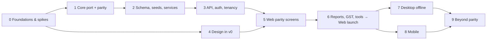

# Qyroxis Inventory — Build Workflow

The plan for building the web version first, then the desktop and mobile shells. Each phase ends with a **gate**: a checklist that has to be fully ticked before the next phase starts, as in the Qyroxis technical playbook.

**Where the logic comes from:** [LOGIC-SPEC.md](LOGIC-SPEC.md). How the pieces fit: [ARCHITECTURE.md](ARCHITECTURE.md).

Phase 4 (design) runs **in parallel** with Phases 1–3. It only needs the module list and the field lists, and both are already in the spec.

---

## Phase 0 — Foundations and spikes

1. **Monorepo setup.** Scaffold the repo in `Inventory/`: pnpm workspaces, Turborepo, TypeScript strict, ESLint (with the layer-boundary rule from ARCHITECTURE §2), Prettier, Vitest, and GitHub Actions CI.
2. **Empty packages.** Create `apps/{web,api,desktop,mobile}` and `packages/{core,db,services,contract,auth,print,ui}` with empty entry points. CI must be green on the empty repo.
3. **PGlite spike** (removes the biggest risk):
   - Run the Drizzle `pg` schema for 3 tables on both PGlite (Node, filesystem) and Postgres 16.
   - Post 10,000 synthetic sale vouchers in transactions on each.
   - Measure save time and the size on disk.
   - **Fallback** if PGlite is too slow or unstable: run desktop on a bundled portable Postgres. It's the same dialect, but makes a heavier installer.
4. **Parity exporter.** In `MDA-Inventory`, add `tool/export_golden.dart`, a plain Dart CLI that doesn't need Flutter. It feeds a fixture set through the pure Dart functions and writes JSON to `Inventory/tools/parity/golden/*.json`.
   - **Functions covered:** `GstCalculator.compute`, `roundOff`, `SaleLine.compute`, `SaleTotals.of`, `PurcLine.compute`, `PurcTotals.of`, `Validators.*`, `amountInWords`, `CodeGen` suffix logic, Indian number formatting.
   - **Fixture set:** about 2,000 randomised cases plus edge cases: negative half-paise, 0.25 % GST, 100 % discount, qty 0.001, and interstate with an empty state code.
5. **Decisions.** Done 2026-10-02:
   - TypeScript, confirmed
   - every quirk ported as is ([LOGIC-SPEC §14](LOGIC-SPEC.md#14-quirk-register--all-kept-as-is))
   - unbranded build ([§15](LOGIC-SPEC.md#15-branding))

**Gate 0**
- [x] Monorepo green locally: lint, typecheck, test, build (2026-10-02). CI runs once the repo is on GitHub.
- [x] PGlite spike numbers recorded in `decisions.md`: **go** (Postgres comparison run pending Docker)
- [x] Golden JSON generated from Dart (10 files) and checked by `@qi/core` tests
- [x] Owner decisions recorded (2026-10-02)

---

## Owner-directed order (2026-10-03)

The owner chose to build the **login/auth screens first**, with approval before each step. Login prerequisites are done:
- **Core:** password hashing, validators, date/FY rules, company/year rules, book-login rules, all with golden/Dart-derived tests
- **Database:** tables `companies`, `financial_years`, `books`, `book_users`, `audit_log`, and the better-auth tables
- **Services:** company create/list, year create/list (creating a year seeds `admin`/`admin` only for now), book login, forced password change
- **API:** routes for all of the above, the account layer and the book cookie
- **Web:** foundation only: Tailwind, theme tokens, routing with guards, typed API client, placeholder screens

**Next, awaiting approval:** the login/auth screens. The phases below still apply to everything else.

## Phase 1 — Port `@qi/core` (pure logic)

Port in this order. Each step must match the golden output exactly before the next one starts.

1. `round2` (half away from zero), `roundOff`
2. `gst.ts`: `isInterState`, `computeLine`
3. `sale.ts`, `purchase.ts`: line factories and totals
4. `posting-rules.ts`: pure journal builders. `saleJournal`, `purchaseJournal`, `receiptJournal`, `paymentJournal`, `debitNoteJournal` and `creditNoteJournal` each return `AcctLine[]` plus `BillLine[]`, following LOGIC-SPEC §6.
5. `validate.ts`: every message in LOGIC-SPEC §9, verbatim
6. `validators.ts`: GSTIN checksum, PAN, HSN, mobile, email, PIN
7. `codes.ts`, `words.ts`, `format.ts`, `dashboard.ts` (ageing: oldest-first settlement)

**Tests:**
- `core/test/golden.test.ts` loads each JSON file and checks for exact equality. The tolerance is 0: these are rounded doubles and must match bit for bit.
- Port the pure-logic cases from the 15 Dart test files (`gst_calculator_test`, `security_test`, the totals parts of `sale_service_test`/`purchase_service_test`, and the pure parts of `dashboard_service_test`) to Vitest.

**Gate 1**
- [ ] 100 % of golden cases pass
- [ ] Every ported Dart test passes
- [ ] `core` has zero runtime dependencies

---

## Phase 2 — Schema, seeds and services

1. **`packages/db` schema.** Write the Drizzle schema from the mapping in LOGIC-SPEC §2, including tenancy columns, uuid v7 ids, `numeric` money, and case-sensitive unique names, as in MDA (Q-15).
2. **Migrations.** Generate them with drizzle-kit. They are the single migration history for both Postgres and PGlite.
3. **Seeds.** Write `seedBook(tx, ctx)`, porting every seed in LOGIC-SPEC §3 verbatim.
4. **`packages/services`.** Implement modules in this order: `posting` → `masters/*` → `purchase` → `sale` → `company`/`financial years` → `dashboard` → `audit`. Each one follows the Dart service's function surface, and the money maths always calls `@qi/core`.
5. **Integration tests on in-memory PGlite.** One fresh book per test, the equivalent of `DbService.openInMemoryForTests`. Port the DB-level cases from `posting_service_test`, `sale_service_test`, `purchase_service_test`, `migration_test`, `sale_type_service_test`, `misc_list_service_test` and `dashboard_service_test`. Add tests for:
   - concurrent numbering: 20 parallel saves using the same preview number give exactly 1 success and 19 failures with MDA's "already used" message, and never a duplicate number
   - FY guard
   - stock guard
   - cancel reverses stock
   - one test per Q-register row that pins the quirk, so no one "fixes" it by accident

**Gate 2**
- [ ] Every DB-level Dart test has a passing TS equivalent
- [ ] The concurrency test passes on real Postgres (Docker in CI), not just PGlite
- [ ] A seeded book matches the Dart seed row for row (checked with a script against a fresh MDA `.db`)

---

## Phase 3 — API, auth and tenancy

1. **`packages/auth`.** Two layers (ARCHITECTURE §3.7):
   - **Account login:** better-auth, email + password. Web/mobile only.
   - **Book login:** MDA's login ported exactly: per-book `book_users`, PBKDF2 + legacy plain text, forced password change, `admin`/`admin` seeded in each new book, no lockout.
2. **`apps/api`.** Hono app with:
   - session middleware → `BookContext` resolution (account session + book session)
   - a zod-validated route per service function, with schemas in `@qi/contract`
   - `PostingException` → 422
   - `/healthz`
3. **Book isolation.** Requests can only reach books owned by the logged-in account. Test: account A cannot read or write account B's book.
4. **Typed client.** Export `AppType`, so `apps/web` gets `hc<AppType>()`.

**Gate 3**
- [ ] Sign up → company → year → book login (admin/admin → forced change) → post a sale, all through the API (scripted E2E)
- [ ] A user from an imported MDA `.db` can log in with their old password
- [ ] Cross-account isolation tests green

---

## Phase 4 — Design (runs in parallel with Phases 1–3)

Follow playbook Phase 3:
1. **Actors:** Owner/Admin, Accountant (Manager), Billing operator (Operator), Auditor/CA (Viewer).
2. **One flow per actor** in Excalidraw. Example: Operator → login → pick book → New Sale (counter) → print → next bill.
3. **Generate the screens in v0.dev** (React + Tailwind + shadcn), in this priority order:
   1. App shell: sidebar sections from LOGIC-SPEC §1, header with company + FY pill, status bar, Ctrl+K palette
   2. Login, company/year picker (now a post-login "book switcher")
   3. Sale Invoice and Purchase Invoice. These are the heaviest screens: header, line-entry row, grid, totals panel.
   4. Voucher screens: Receipt/Payment, Journal, DN/CN
   5. Master form + View list pattern: build **one** generic `MasterPage` layout and reuse it for all 9 masters
   6. Dashboard
   7. Every empty, loading, error and "cancelled (read-only)" state
4. **Mobile breakpoints** for the mobile shortlist (ARCHITECTURE §5.3).
5. **Keyboard map review.** Walk each screen using only Enter, Tab and arrow keys, against LOGIC-SPEC §10.

**Gate 4**
- [ ] All the screens above exist on a staging URL
- [ ] Keyboard walk-through done for Sale, Purchase and Ledger
- [ ] Owner approval in writing, with the date

---

## Phase 5 — Web parity: build every screen MDA already has

### The per-feature loop

Run this loop for every feature. A feature is **done** only when all 7 steps are ticked.

1. **Spec.** Re-read the LOGIC-SPEC section and the Dart page and service, and note any Q-register rows that apply.
2. **Contract.** Write the zod request/response schemas in `@qi/contract`.
3. **Route.** API route and service wiring; the service tests already exist from Phase 2.
4. **Screen.** Build it from the v0 output. Use the `@qi/ui` primitives (`LookupBox`, `useEnterNav`, `DataGrid`, `MasterPage`), and use `@qi/core` for live totals.
5. **E2E.** A Playwright happy path, plus one validation failure that checks the exact message.
6. **Side-by-side parity check.** Enter the **same document** in the old Flutter app and in the new web app. Compare the totals, the journal (`voucher_ledger_lines` vs `VchrAcct`), the stock movement and the printout. Record it in `docs/parity-log.md`.
7. **Review.** Run `/code-review`, then merge.

### Build order

1. Setup: company create/edit, financial years, login + forced password change, book switcher
2. Accounting masters: Group → Sub Group → Ledger (with City self-learning and the GSTIN/state rules)
3. Inventory masters: Unit → Godown → Stock Group → Stock Sub Group → Stock Item → Sale Type
4. Accounting vouchers: Receipt → Payment → Journal → Debit Note → Credit Note
5. Purchase Invoice
6. Sales Invoice (stock guard, cash/credit, sale-type numbering, bill discount)
7. Dashboard
8. Printing: Receipt/Payment PDF (port), Sales tax invoice (new)
9. User Management and the audit "Logs" viewer

**Gate 5**
- [ ] Every row in LOGIC-SPEC §1 marked "Built" works in the web app
- [ ] `parity-log.md` has a passing entry for every voucher type
- [ ] E2E suite green

---

## Phase 6 — Reports, GST and tools → web launch

MDA has **no logic** for these yet, so each one needs a short spec written first, as an addition to LOGIC-SPEC. The data they need already exists: ledger lines, stock movements, BillRefs and the sale/purchase masters.

| Item | Built from |
|---|---|
| Day Book | Vouchers by date |
| Ledger statement | `voucher_ledger_lines` + opening balance |
| Trial Balance | All of the above |
| Stock Summary | `stockInHand` per item and godown, valued the same way as the dashboard |
| Sales Register, Purchase Register | `sales`, `purchases` |
| P&L, Balance Sheet | Group tree × GrpType (A/L/E/I) |
| Outstanding / ageing | The dashboard pending-bill algorithm |
| GSTR-1 | B2B/B2C/HSN sections from `sales` + `sale_lines` |
| GSTR-3B summary | Output tax − ITC |
| HSN Summary | Item lines |
| ITC register | Purchase input tax |
| Company Settings | Edit company + series prefixes/widths (`voucher_series`) |
| Backup | Cloud: owner-triggered export of their books (JSON/CSV zip) |
| Import | `tools/importer`: MDA registry + year `.db` files → a new org. Used for migrating existing MDA customers. |

**Launch:** deploy per the playbook: an `inventory_app` container, a Caddy site, a DB on the shared Postgres, backups taken **and restored**, UptimeRobot. Then run UAT with 1–2 real MDA customers on imported data.

**Gate 6**
- [ ] Each report checked against a hand-computed sample book
- [ ] At least one real MDA customer's data imported; trial balance matches the old app
- [ ] Playbook Phase 0 gate satisfied for this app (backup restored, monitor firing)
- [ ] Live on `inventory.qyroxis.com`

---

## Phase 7 — Desktop (offline)

1. **Electron main process.** PGlite at `%APPDATA%\Qyroxis Inventory\data`, run migrations, start the Hono app in-process on `127.0.0.1:<random>` with a per-launch token.
2. **Load the web build.** Runtime config sets `apiBaseUrl`. No UI code changes; if one turns out to be needed, it is a bug in the abstraction.
3. **Local auth.** The same better-auth, with org/company/FY created on first-run setup.
4. **Desktop extras:** silent printing (`webContents.print`), Backup/Restore to a `.tar.gz` file, Import from MDA `.db` files on the same PC.
5. **Ship.** `electron-builder` NSIS installer, code signing, `electron-updater` from a release feed.

**Gate 7**
- [ ] Full E2E suite passes against the desktop build with no network connection
- [ ] Backup → uninstall → reinstall → restore round-trip works
- [ ] Installer signed

---

## Phase 8 — Mobile

1. **Capacitor wrap** of `apps/web` with the cloud `apiBaseUrl`.
2. **Mobile layouts** for the shortlist; everything else gets a usable single-column fallback.
3. **Native bits:** share-sheet for PDFs, biometric unlock (optional), camera barcode scan into the item lookup (stock items have a `Barcode` column).
4. **Ship.** Play Store first, then the App Store.

**Gate 8**
- [ ] Counter sale + print/share works end-to-end on a mid-range Android phone
- [ ] Store listing approved

---

## Phase 9 — Beyond parity (backlog, in priority order)

1. Year-end: "Create next year from this one", which copies masters and carries closing ledger balances and stock as the new year's opening
2. Sales Return / Purchase Return with GST and stock (the `SRT`/`PRT` series already exist), so DN/CN can carry items
3. Stock Journal / godown transfer (`STJ`) + per-godown stock guard (Q-27)
4. Freight / other charges on invoices, batch and expiry
5. FIFO / weighted-average stock valuation
6. Bill-wise settlement UI on Receipt/Payment (`Against` RefType)
7. E-invoice / e-way bill
8. Desktop ↔ cloud sync

---

## Day-to-day dev rules

- **Branches:** `main` is always deployable. Create a feature branch per feature, and open a PR that names the LOGIC-SPEC section and Q-rows it implements.
- **Logic changes:** any change to money, tax, numbering or posting behaviour must update LOGIC-SPEC **in the same PR**, and add or adjust a golden or integration test.
- **Never compute persisted money in the UI.** Live previews call `@qi/core`; the server recomputes.
- **Every write goes through `@qi/services` in one transaction.** No ad-hoc SQL in routes.
- **Messages:** user-facing error text comes from `@qi/core/validate.ts` only, so the wording stays identical everywhere.
